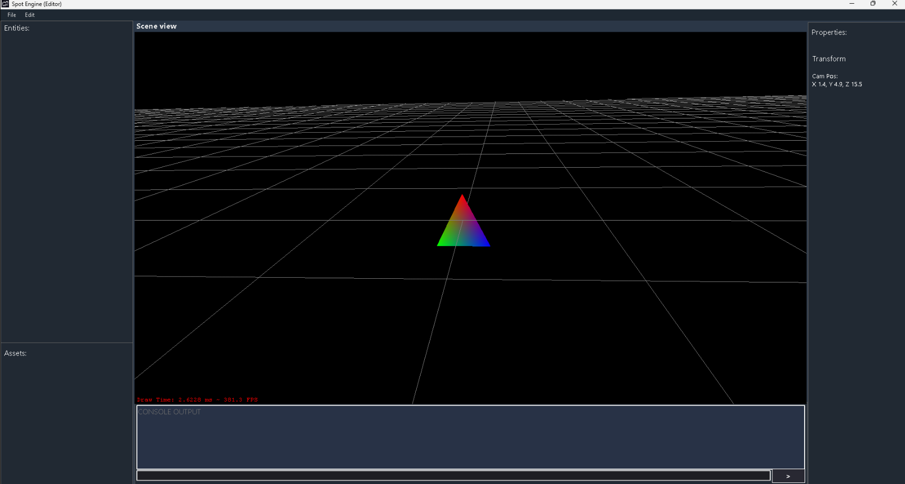

# Spot Engine

  

**SpotEngine** is a lightweight and flexible game engine designed to empower game developers to create captivating 2D and 3D experiences. With a focus on simplicity and extensibility, SpotEngine provides the foundation for building interactive games, simulations, and interactive applications.

## Key Features
 

**Graphics Rendering**: Utilize the power of OpenGL through OpenTK to render stunning visuals for your games.

**Entity-Component System**: Implement game logic and functionality using a versatile entity-component system (ECS) architecture.

**Cross-Platform**: Develop games that run seamlessly on multiple platforms, including Windows, macOS, and Linux.

**Customization**: Extend and customize the engine to suit your project's unique requirements.

**Simplified Entity** Creation: Create and manage game objects effortlessly with a straightforward API.

## Getting Started
To start developing with SpotEngine, simply include it in your project and leverage its features to bring your game ideas to life. Explore the provided examples and documentation to learn how to harness the engine's capabilities.

## Documentation
For detailed documentation and examples, visit the <a href="https://learn.trivalent.tech/spot-engine/docs">SpotEngine Documentation.</a>

## Contributing
We welcome contributions from the community to enhance SpotEngine. Whether it's fixing bugs, adding features, or improving performance, your contributions are valuable in making this engine even better.

## License
SpotEngine is licensed under the <a href="LICENSE.md">MIT License.</a>
