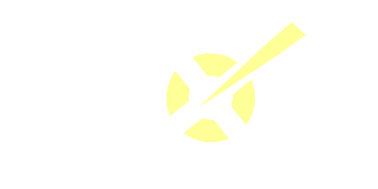

<div align="center">
  
</div>

# 🎮 Spot Game Engine
Welcome to the Spot Game Engine, a work-in-progress game engine built entirely in C#.

You can explore the source code and contribute if you wish. Here's how you can get started:

## 🛠️	Building from Source
```sh
git clone https://github.com/lucasdcampos/SpotEngine.git
cd SpotEngine
```

Now you can Build it from source:

Windows:
```sh
.\build.ps1
```
Linux:
```
chmod +x build.sh
./build.sh
```

## :handshake: How to Contribute

We welcome contributions to the Spot Game Engine! If you'd like to contribute, please follow these steps:

1. Fork the repository.
2. Create a new branch for your feature or bug fix.
3. Make your changes and ensure they follow coding standards.
4. Submit a Pull Request (PR) with your changes.
5. Your PR will be reviewed, and upon approval, it may be merged.

For major changes or significant contributions, please discuss your ideas in advance by opening an issue.

## 📄 License

The Spot Game Engine is open source and available under the MIT License. See [LICENSE](LICENSE.txt) for more details.
