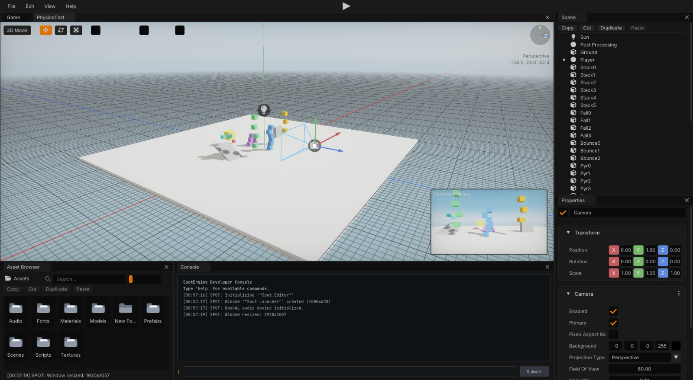

# Spot Engine

Spot is a 2D/3D game engine written in C# (.NET 10), built on [Silk.NET](https://github.com/dotnet/Silk.NET)
(windowing, OpenGL, input, Assimp) and [Dear ImGui](https://github.com/ocornut/imgui). It ships with an
ImGui-based editor, a sample game, and a `spot` command-line tool for creating and building projects.



## Requirements

- [.NET 10 SDK](https://dotnet.microsoft.com/download)

## Building

Build everything from the repo root:

```bash
dotnet build SpotEngine.slnx
```

## Running

```bash
dotnet run --project editor    # launch the editor
dotnet run --project sandbox/Sandbox.csproj      # run the sandbox project
```

## The `spot` CLI

The command-line tool creates and builds projects:

```bash
# Create a new project
dotnet run --project tools/Spot.Cli -- new MyGame --path <dir>

# Cook assets and run a project from source (quick iteration)
dotnet run --project tools/Spot.Cli -- run --project <dir>

# Publish a self-contained standalone build (windows | linux)
dotnet run --project tools/Spot.Cli -- build windows --project <dir>

# Show all commands
dotnet run --project tools/Spot.Cli -- help
```

## Layout

| Path | Description |
|---|---|
| `engine/` | The engine library (`Spot.Engine`) |
| `editor/` | The ImGui-based editor |
| `sandbox/` | A sample game |
| `tools/` | `Spot.Build` (project/build library) and the `spot` CLI |

## License

See [LICENSE.txt](LICENSE.txt).
