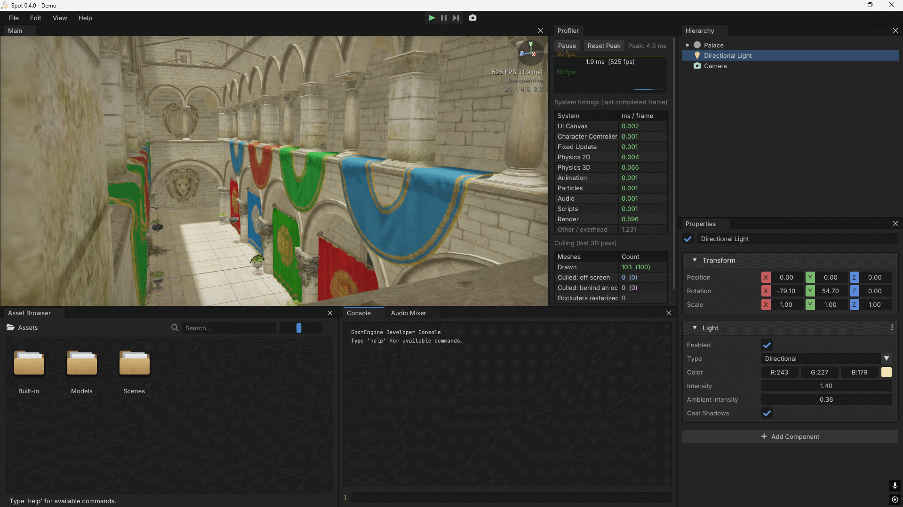

# Spot Engine

Spot is a 2D/3D game engine written in C# (.NET 10), built on [Silk.NET](https://github.com/dotnet/Silk.NET)
(windowing, OpenGL, input, Assimp) and [Dear ImGui](https://github.com/ocornut/imgui). It ships with an
ImGui-based editor, samples, and a `spot` command-line tool for creating and building projects.

Spot comes in three levels, each usable on its own (see [docs/levels.md](docs/levels.md)):

- **Core** (`Spot.Framework.Core`) — a window, events, raw input, the GPU, a minimal 2D batch and an audio
  device. You write the loop.
- **Framework** (`Spot.Framework`) — a code-only layer in the spirit of raylib or MonoGame: sprites, text,
  basic 3D, models, skeletal animation, a mixer, input actions.
- **Engine** (`Spot.Engine`) — the full engine: scenes, the lit renderer, physics, particles, UI, assets,
  the editor and the CLI.



## Requirements

- [.NET 10 SDK](https://dotnet.microsoft.com/download)

## Quick setup

Compile the whole engine and install the `spot` CLI on your PATH in one step:

```bash
scripts\setup.bat      # Windows
bash scripts/setup.sh  # Linux
```

Open a new terminal afterwards, then run `spot help`. `scripts/build.bat`/`build.sh`
compile only; `scripts/uninstall.bat`/`uninstall.sh` remove `spot` from PATH.

## Building

Build everything from the repo root:

```bash
dotnet build SpotEngine.slnx
```

## Running

```bash
dotnet run --project editor                  # launch the editor
dotnet run --project samples/HelloQuad       # a framework-only program (also HelloTriangle, Hello2D, Hello3D)
dotnet run --project tools/Spot.Cli -- run --project samples/HelloEngine  # an engine project, cooked and run
dotnet run --project tools/Spot.Cli -- run --project samples/SolarSystem  # the solar-system showcase
dotnet run --project tools/Spot.Cli -- run --project samples/ProvingGrounds  # the FPS playground
```

## The `spot` CLI

The command-line tool creates and builds projects:

```bash
# Create a new project
spot new MyGame --path <dir>

# Cook assets and run a project from source (quick iteration)
spot run --project <dir>

# Publish a self-contained standalone build (windows | linux)
spot build windows --project <dir>

# Show all commands
spot help
```

## Layout

| Path | Description |
|---|---|
| `framework/` | The framework: `Spot.Framework.Core` (level 1), `Spot.Framework` and `Spot.Framework.Assimp` (level 2) |
| `engine/` | The engine library (`Spot.Engine`, level 3) |
| `editor/` | The ImGui-based editor |
| `debugui/` | Debug/authoring panels shared by the editor and the runtime overlay |
| `net/` | Networking (`Spot.Net`) |
| `samples/` | Small programs for each level, plus three engine projects: `HelloEngine`, the `SolarSystem` showcase and the `ProvingGrounds` FPS playground |
| `tools/` | `Spot.Build` (project/build library) and the `spot` CLI |
| `tests/` | The xUnit test suites |
| `docs/` | Documentation |

## License

See [LICENSE.txt](LICENSE.txt).
