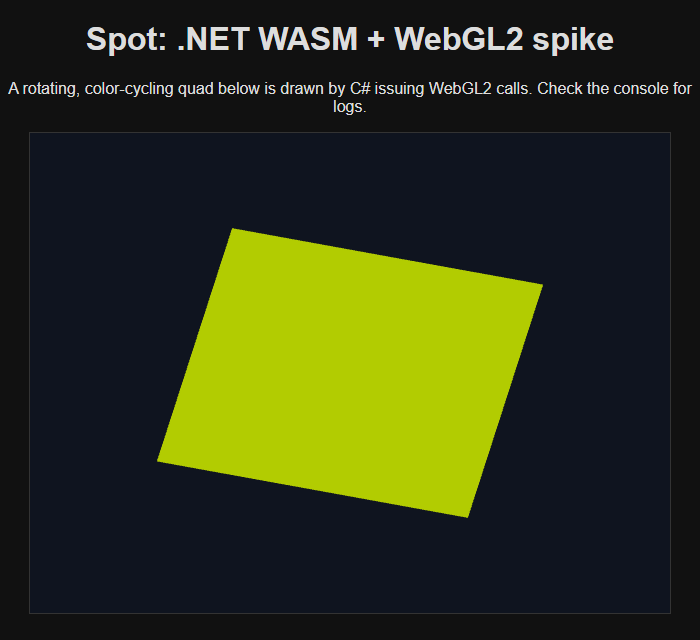

# Spike findings — .NET WASM + WebGL2 for Spot in the browser

**Verdict: GREEN.** A .NET 10 program compiled to WebAssembly renders with WebGL2 in the
browser, with C# issuing every GL call, and a real managed NuGet the engine uses runs correctly
under the default trimmed publish. The toolchain closes end-to-end.



## Environment (reproducible)

- .NET SDK **10.0.302**.
- Workloads: `wasm-tools` (already present) + **`wasm-experimental`** (installed for the
  `wasmbrowser` template). Pulls Emscripten **3.1.56** provisioned by the SDK — no manual
  Emscripten setup.
- Windows 11. Verification browser: headless Edge with SwiftShader
  (`--enable-unsafe-swiftshader --use-angle=swiftshader`).

## What was validated (all 5 criteria)

Console output from the **Release (trimmed, SIMD on)** build served as a static site:

```
[spike] WebGL2 context acquired: WebGL 2.0 (OpenGL ES 3.0 Chromium)
[spike] .NET wasm runtime is alive.
[spike] smoke: encoded PNG = 78 bytes; decoding...
[spike] StbImage round-trip OK: 2x2, 16 bytes. Managed deps work under wasm.
[spike] GL init complete: shaders compiled + linked, quad uploaded.
```

1. `wasm-tools` builds/publishes a `net10.0` wasm app on this machine. ✅
2. A `<canvas>` yields a **WebGL2** context from .NET. ✅
3. A **GLSL ES 3.0** (`#version 300 es`) shader compiles + links. ✅
4. A rotating, color-cycling quad draws via VAO/VBO/`drawArrays`, loop driven by
   `requestAnimationFrame` passing delta into a `[JSExport] Frame(double)`. ✅ (screenshot)
5. Real managed NuGets (`StbImageWriteSharp` + `StbImageSharp`, the engine's image path) encode
   + decode a PNG under **default trimming**. ✅

## Key technical decisions & learnings

- **WebGL2 accessed via `[JSImport]`, not Silk.NET.OpenGLES.** C# owns the frame logic and issues
  each GL command; `main.js` implements a thin GL surface bound to the real WebGL2 context, with a
  JS-side integer handle table for GL objects. This *is* the graphics-device seam the engine port
  needs anyway, it's robust, and it needs **no emcc flags**.
- **Silk.NET.OpenGLES remains a viable alternative.** The native relink already links Emscripten's
  GL/AL/HTML5 libs (`-lGL-getprocaddr -lal -lhtml5`), so a future experiment could wire
  `Silk.NET.OpenGLES` to Emscripten's `getProcAddress` to reuse GL-style bindings on both desktop
  and web. Trade-off: potentially less engine-side rewrite vs. more toolchain fiddliness. Not
  needed to proceed.
- **Runtime model:** Mono interpreter (no AOT). `Microsoft.NET.Sdk.WebAssembly`, TFM `net10.0`
  (the `browser` targeting is implied by the SDK; a literal `net10.0-browser` TFM is not required).
  NativeAOT-LLVM (more perf, more trimming friction) is deferred.
- **Publish output** is fingerprinted (`main.<hash>.js`, `_framework/dotnet.<hash>.js`, assemblies
  shipped as `*.wasm`) with an **import map** + SRI in `index.html`. A static host must serve
  `.wasm` as `application/wasm`; the built-in `dotnet run` dev server does this correctly.
- **Trimming + SIMD defaults are fine.** The managed round-trip works with size-opt (`-Oz`) and
  wasm SIMD on. No trimmer roots needed for StbImageSharp.
- **Gotcha (cost me an iteration):** an unhandled managed exception in `Main` rejects `runMain()`
  and silently prevents rendering. Wrap startup work in try/catch. Also: my first smoke test used a
  hand-picked "1x1 PNG" base64 that was actually **malformed** — it failed identically on desktop
  (`InvalidOperationException: IE` is stb's decode-failure path, not a wasm bug). Lesson: validate
  with genuinely valid assets; don't trust a random base64 blob.

## Implications for the engine port (MVP 2D)

The spike confirms the enabling architecture. Mapping to the deferred port plan:

- **Rendering:** introduce an `IGraphicsDevice`/backend seam over the ~15 direct `GL` call sites
  (`engine/Rendering/Renderer.cs`, `Shader.cs`, `Texture2D.cs`, `VertexArray.cs`, …); the browser
  backend is JSImport WebGL2 exactly as prototyped here. Convert embedded shaders from
  `#version 330 core` → `#version 300 es` (+ `precision`). WebGL2 = GLES 3.0 supports
  `sampler2DShadow`/depth-compare, so shadow mapping ports (relevant for 3D later).
- **Loop:** `requestAnimationFrame` → `[JSExport] Frame(dt)`; single-threaded (force Bepu
  `ThreadDispatcher(1)`; make `ModelImporter`'s `Task.Run` path synchronous or worker-based).
- **Assets:** replace `System.IO.File.*` reads (`AssetManifest`, `CookedFormats`, `Texture2D`,
  `SceneSerializer`, `AudioClip`) with an `IAssetProvider` that `fetch`es cooked `Content/`.
- **Audio:** Web Audio backend behind the existing `AudioManager` facade (OpenAL is the only
  native piece; decode via `StbVorbisSharp` is managed).
- **Input:** DOM events → existing `Input.cs` facade (swap the event source only).
- **Build:** add a `browser` target to `ProjectBuilder`/`ProjectGenerator` emitting a
  `Microsoft.NET.Sdk.WebAssembly` project + `wwwroot` + cooked `Content/`.
- **Managed deps** (StbImageSharp/Write, BepuPhysics, Aether.Physics2D) expected to work; validate
  each with real assets. Assimp stays cook-time only (never shipped).

## How to run the spike

```bash
# From repo root:
cd experiments/web-spike
dotnet run                     # Debug: builds + serves + opens browser (http://localhost:5222)
# or test the trimmed build:
dotnet publish -c Release      # output: bin/web-spike/Release/net10.0/publish/wwwroot
```
Serve the publish `wwwroot` with any host that returns `application/wasm` for `.wasm`
(the `dotnet run` dev server already does). You should see a rotating, color-cycling quad and the
`[spike]` logs in the browser console.

## Possible next spikes (optional, before/with the port)

- Step a **BepuPhysics** simulation for a few frames in-browser (validate the physics-reuse claim).
- `fetch` and load a **cooked `.sptex`/`.spmesh`** to prove the `IAssetProvider` path.
- Play a sound through **Web Audio** decoded by `StbVorbisSharp`.
